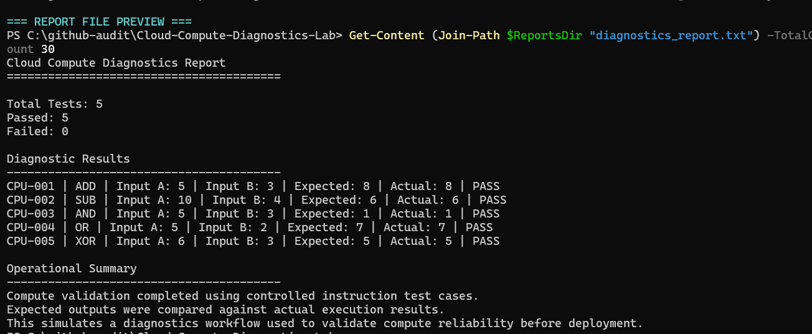

# Cloud Compute Diagnostics Lab

## Overview

This project simulates a cloud engineering diagnostic system used to validate compute operations and ensure instruction accuracy within a processing environment.

It combines low-level compute unit planning with a structured diagnostics runner that tests, validates, and reports on system behavior.

The original project focused on ALU design documentation. This upgraded version positions the work as a compute diagnostics lab that connects digital logic, validation testing, and reliability-focused engineering workflows.

---

## Diagnostics Report Preview

The screenshot below shows the diagnostics runner validating compute operations, comparing expected versus actual outputs, and generating a structured report.



---

## Project Objective

To simulate how cloud engineers validate system reliability by:

- Executing Controlled Instruction Test Cases
- Comparing Expected Versus Actual Outputs
- Identifying Inconsistencies In Compute Logic
- Generating Structured Diagnostic Reports
- Supporting Root Cause Analysis For Incorrect Outputs

---

## Simulated Environment

- Compute Unit Executing Arithmetic And Logic Operations
- Input-Driven Instruction Testing
- Diagnostics System Validating Execution Results
- JSON-Based Test Case Definitions
- Report Generation For System Analysis

---

## System Architecture

```text
Compute Layer
        |
        v
ALU Design Documentation And Compute Operation Definitions
        |
        v
Diagnostics Layer
        |
        v
Python Script Running Validation Tests
        |
        v
Data Layer
        |
        v
JSON-Based Test Case Definitions
        |
        v
Reporting Layer
        |
        v
Generated Diagnostics Report Summarizing Results
```

This structure reflects how engineering teams separate compute logic, test data, validation execution, and reporting when checking system reliability.

---

## Scenario

In cloud systems, incorrect instruction execution can cause:

- Data Corruption
- Unexpected Application Behavior
- System Instability
- Failed Downstream Processing

This project simulates detecting and diagnosing these issues before deployment by validating compute operations against known expected results.

---

## Diagnostic Workflow

- Load Predefined Test Cases
- Execute Simulated Compute Operations
- Compare Expected Versus Actual Outputs
- Identify Failed Test Cases
- Generate A Structured Diagnostics Report
- Save The Report For Review And Escalation

---

## Test Cases

| Case ID | Operation | Input A | Input B | Expected | Actual | Status |
|---|---:|---:|---:|---:|---:|---|
| CPU-001 | ADD | 5 | 3 | 8 | 8 | Pass |
| CPU-002 | SUB | 10 | 4 | 6 | 6 | Pass |
| CPU-003 | AND | 5 | 3 | 1 | 1 | Pass |
| CPU-004 | OR | 5 | 2 | 7 | 7 | Pass |
| CPU-005 | XOR | 6 | 3 | 5 | 5 | Pass |

---

## Implementation

- Designed The Project Around ALU Compute Validation
- Created JSON-Based Test Cases For Validation Scenarios
- Developed A Python Diagnostics Runner To Execute And Verify Results
- Implemented Report Generation To Summarize System Behavior
- Preserved Existing ALU Documentation As Architecture Reference Material

---

## Diagnostics Output

Example report:

```text
Cloud Compute Diagnostics Report
========================================

Total Tests: 5
Passed: 5
Failed: 0

CPU-001 | ADD | Input A: 5 | Input B: 3 | Expected: 8 | Actual: 8 | PASS
CPU-002 | SUB | Input A: 10 | Input B: 4 | Expected: 6 | Actual: 6 | PASS
CPU-003 | AND | Input A: 5 | Input B: 3 | Expected: 1 | Actual: 1 | PASS
```

---

## Repository Structure

```text
Cloud-Compute-Diagnostics-Lab/
|-- logisim/
|   |-- README.md
|   |-- cloud_compute_unit.circ
|
|-- reports/
|   |-- diagnostics_report.txt
|
|-- screenshots/
|   |-- diagnostics-report.png
|
|-- diagnostics_runner.py
|-- test_cases.json
|-- README.md
|-- ALU_Instruction_Set.md
|-- ALU_Architecture_Notes.md
|-- ALU_Test_Plan.md
|-- Basic ALU.docx
```

Note: the verified Logisim .circ file and circuit screenshots should be added after the ALU circuit is exported from Logisim.

---

## Technologies Used

- Logisim For Digital Logic Simulation
- Python For Diagnostics And Validation
- JSON For Test Case Definitions
- Text Reports For Diagnostic Output
- ALU Design Documentation For Compute Logic Reference

---

## How To Run

Run diagnostics:

```powershell
python diagnostics_runner.py
```

View output:

```text
reports/diagnostics_report.txt
```

When the verified Logisim circuit is available, place it here:

```text
logisim/cloud_compute_unit.circ
```

---

## Planned Enhancements

- Introduce Automated Failure Detection Alerts
- Expand Test Coverage Across More Instruction Types
- Simulate Multi-Step Instruction Pipelines
- Add Visualization Dashboard For Diagnostics
- Add Verified Logisim Circuit Export
- Add ALU Circuit Screenshots
- Add Failing Test Case Examples For Troubleshooting Practice

---

## Real-World Relevance

This project reflects cloud engineering and support practices:

- Validating System Behavior Before Deployment
- Detecting Low-Level Computation Errors
- Supporting Root Cause Analysis For Incorrect Outputs
- Ensuring System Reliability And Consistency
- Creating Repeatable Diagnostic Reports
- Separating Test Data, Execution Logic, And Reporting Output

---

## Professional Positioning

Before, this project showed ALU planning.

Now, it demonstrates a diagnostics system that validates compute reliability and generates reports.

That is a stronger portfolio story because it connects low-level computer architecture knowledge to reliability testing, validation workflows, and operational diagnostics.
